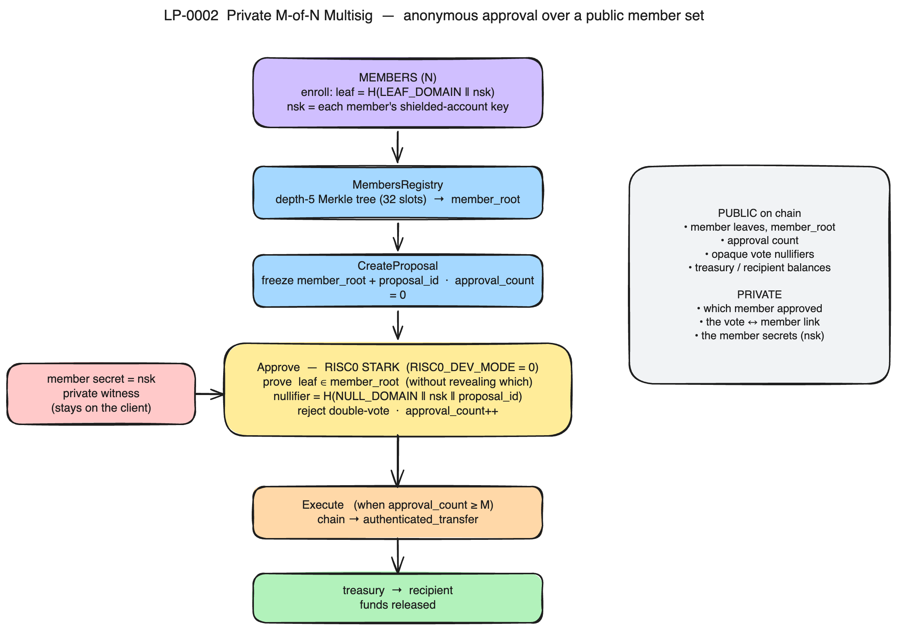

# LP-0002 Architecture (map)

A one-page map of the private M-of-N multisig: where the code lives, how a
proposal flows from enrollment to execution, and what is public versus private
on chain. This is an overview. The authoritative write-up, with the threshold
scheme, nullifier design, LEZ account-model handling, security assumptions, and
known limitations, is [`docs/LP-0002-solution.md`](LP-0002-solution.md).

## Components (our LP-0002 contribution)

| Component | Path | Role |
|-----------|------|------|
| `msig_core` | `programs/msig/core/src/lib.rs` | Shared types, the depth-5 member Merkle scheme, domain-separated leaf and nullifier hashing, the five `MsigInstruction` variants, and the error strings. Byte-identical in-guest and host-side. |
| Guest | `test_program_methods/guest/src/bin/msig.rs` | The on-chain program. Runs `Enroll`, `CreateProposal`, `Approve`, `Execute`, and `InitTreasury` inside the RISC0 zkVM. |
| Client runners | `examples/program_deployment/src/` | `run_deploy`, `run_enroll`, `run_create_proposal`, `run_approve`, `run_init_treasury`, `run_execute`, `run_assert_state`, plus the shared `msig_demo` fixture. |
| Basecamp app | `basecamp/` | The Logos Basecamp `ui_qml` voting plugin: derive leaf, cast anonymous vote, threshold meter, execute. |
| IDL | `idl/lp0002-msig.idl.json` | SPEL-format interface for the deployed program. |
| Demo | `scripts/lp0002-demo.sh` | Reproducible end-to-end run against a local sequencer at `RISC0_DEV_MODE=0`. |

Everything else (the privacy-preserving transaction circuit, the public-tx apply
path, the `authenticated_transfer` builtin, the wallet, the sequencer) is
upstream nssa v0.1.2, which we build on and credit.

## Flow



*(Editable source: [`lp0002-architecture.excalidraw`](lp0002-architecture.excalidraw), open at excalidraw.com.)*

```
Enroll (public leaf) xN  -->  MembersRegistry  -->  member_root
                                                      |  frozen into the proposal by
                                                      v
                                               CreateProposal
   member secret (private witness)  -->  Approve  [RISC0 STARK]
                                               proves the secret's leaf is in member_root
                                               (without revealing which leaf),
                                               records a proposal-bound nullifier,
                                               increments the public count
                                                      |  count >= M
                                                      v
                                               Execute  -->  authenticated_transfer  -->  recipient
```

1. **Enroll.** Each member publishes only the leaf `H(LEAF_DOMAIN || secret)`
   into the `MembersRegistry`; the registry recomputes `member_root` over a
   depth-5 tree (32 slots).
2. **CreateProposal.** Claims a fresh `ProposalState` and freezes `member_root`
   and `proposal_id` into it with `approval_count = 0`.
3. **Approve.** A privacy-preserving transaction. In-circuit it proves the
   approver's leaf is in the frozen `member_root`, derives the proposal-bound
   nullifier `H(NULL_DOMAIN || secret || proposal_id)`, rejects a double vote,
   and increments the count. The proof is a real RISC0 STARK at
   `RISC0_DEV_MODE=0`.
4. **Execute.** Once `approval_count >= M`, releases the treasury to the
   recipient by chaining a call into `authenticated_transfer`.

## What is public vs private

| Public on chain | Private |
|-----------------|---------|
| member leaves, `member_root` | the member secrets (witness only) |
| approval count | which member cast a given approval |
| opaque vote nullifiers (32 bytes) | the link between a vote and a member |
| treasury and recipient balances | |

The result is approver anonymity within the enrolled set of N public members:
the member list and the count are public; which specific member approved is
hidden. See [`docs/LP-0002-solution.md`](LP-0002-solution.md) for the full
reasoning, the LEZ nonce and `program_owner` handling, and the known limitations.

## Live deployment

Deployed and exercised on LEZ testnet (`testnet.lez.logos.co`) under program id
`HjHCub28GrUNgd2QuJ2SPob7YmaUgDRCGXwbt2jt4UWn`, with a 1-of-N end-to-end run and
a 2-of-3 threshold run. The canonical on-chain ledger (tx hashes and blocks) is
in [`docs/LP-0002-solution.md`](LP-0002-solution.md).
